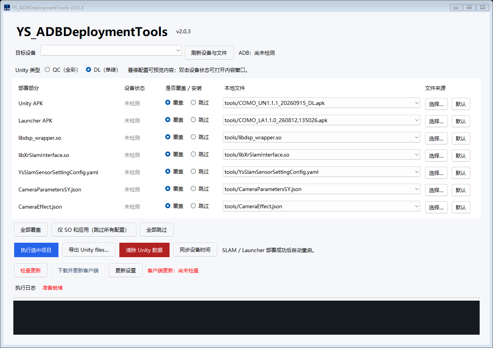

# YS_ADBDeploymentTools

Windows x64 的 Android ADB 部署工具。当前版本 **2.0.3**，主程序为 `YS_ADBDeploymentTools.exe`，自包含运行，无需另装 .NET。

[下载最新客户端](https://github.com/007HaHaXiaoZi/YS_ADBDeploymentTools/releases/latest/download/YS_ADBDeploymentTools.exe) · [使用说明](docs/使用说明.md) · [发布更新](docs/发布更新.md)



## 功能

- SLAM 库 / YAML 或 Launcher 部署成功后，在全部选中项目完成时自动重启一次。
- 红色“清除 Unity 数据”按钮：仅清除 Unity files 内的非配置普通文件，保留配置及应用私有数据。
- “同步设备时间”按钮：以当前电脑时间校准设备，回读验证；需要 root。
- 检查更新提示、准备就绪和安装完成等执行状态使用红色文字。

- QC（全彩）/ DL（单绿）Unity APK 互斥选择，严格匹配大写型号。
- Unity、Launcher、两个 SO、YAML 和两个 JSON 分别选择覆盖或跳过。
- “设备状态”位于覆盖选项之前：读取 APK 真实包名，显示应用是否安装；检测目标文件是否存在，区分缺失与权限/连接错误。
- JSON/YAML 的本地和设备内容均支持悬停预览，双击打开可滚动窗口。
- 每个部分默认从 EXE 旁的 tools 查找，支持自定义文件路径和恢复默认；QC/DL 自定义路径分别记忆。
- 导出 `/sdcard/Android/data/com.horeal.UnityAndroid/files/` 内全部内容到用户选择的本地文件夹，每次使用独立子目录。
- 每次启动异步检查本仓库的 GitHub Release，与设备检测同时运行；下载经过签名和 SHA-256 校验，再由独立进程替换并重启。
- ADB 按真实退出码判断，完整读取 stdout/stderr；Binder warning 保留日志但不作为失败依据。

已移除“仅 SLAM”“仅 Unity/相机配置”“仅 Launcher”的独立部署入口。使用每行的覆盖选择和“执行选中项目”。

## 本地目录

```text
YS_ADBDeploymentTools.exe   # 客户端
YS_ADBReleaseTool.exe       # 发布者工具：签名打包、Git 提交推送、GitHub Release 发布
publisher-public.pem       # 公开签名公钥（也已嵌入客户端）
tools/                     # 本地 APK、SO、JSON、YAML；不提交 Git
src/                       # 可维护源码
tests/                     # 自动测试
scripts/                   # 构建与 GitHub 发布脚本
docs/                      # 使用和发布说明
```

仓库和 Release **均不包含 tools**。使用者需自行放入对应资源或选择外部路径。ADB platform-tools 从本机现有环境或本地 tools/platform-tools 查找。

旧版中文名称 EXE 需先人工换成本版。此后保持文件名 `YS_ADBDeploymentTools.exe` 不变，即可使用已内置的更新地址及公钥。

## 更新地址

```text
https://github.com/007HaHaXiaoZi/YS_ADBDeploymentTools/releases/latest/download/manifest.json
```

Git SSH 地址 `git@github.com:007HaHaXiaoZi/YS_ADBDeploymentTools.git` 用于开发者访问仓库。客户端通过上述 HTTPS 地址下载，不要求客户安装 Git 或配置 SSH。

## 构建与验证

需要 .NET 9 SDK：

```powershell
.\scripts\Build.ps1
# Windows PowerShell 7 下可运行打包验证：
.\tests\Test-GitHubPublisher.ps1
.\tests\Test-PackagedUpdater.ps1
```

自动测试覆盖全部 127 种非空覆盖组合、SLAM 重启顺序、ADB 实际子进程捕获、APK 清单解析、权限检测、自定义路径、数据导出、数据清除命令范围、时间同步校验、签名验证和更新回滚。APK 包名解析另外验证了当前本地三个实际 APK。

设备检测、导出的自动测试使用模拟 ADB，未在发布过程中对真实 Android 执行安装、替换或导出。真实设备需要允许 USB 调试与对应文件访问；系统库/Launcher 部署仍要求固件支持 root/remount。

发布私钥保存在发布者本机 `.release-private/`，不得提交仓库或打包分发。Git 同时忽略缓存、构建中间文件、用户选项和导出数据。

## 发布工具

双击 `YS_ADBReleaseTool.exe` 打开菜单，可生成签名包、提交并推送所选文件、上传并发布 GitHub Release。发布功能已集成到 EXE，不依赖 PowerShell 或 GitHub CLI；需要 Git for Windows 和已登录的 GitHub HTTPS 凭据。

客户端修改版本并构建、提交后，可运行 `YS_ADBReleaseTool.exe release 2.0.3 --notes "更新说明" --upload --push`。具体步骤和命令见[发布更新](docs/发布更新.md)。
